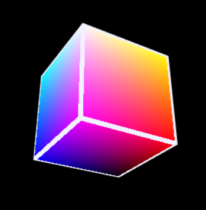

# 用three.js调试简单的shader

文件`simple_shader.js`

目的是演示在WebGL上跑自制shader(着色器)。
框架使用three.js, 搭建hello world参见:

* [three.js](https://github.com/mrdoob/three.js/)

注意，WebGL 1.0使用的shader只支持GLSL 1.0.17, 这是因为WebGL是基于OpenGL ES 2.0的，是给相对于台式机性能较低的手持设备用的。 所以如果在网上找到的GLSL的例子，在WebGL上可能不管用，要注意版本。
GLSL 1.0与现行最高的4版本比起区别还是比较多的，比如老版本里叫attribute, varying的变量到高版本里叫in, out了。
具体WebGL学习参见:
* [Learn WebGL](http://learnwebgl.brown37.net/index.html#)

先上代码:

使用:
git clone代码后进入文件夹, 启动web server, 比如我用node:
```bash
http-server .
```

浏览器打开`http://127.0.0.1:8080/`后，点击Simple Shader按钮。



代码解释:
v_shader和f_shader是我们要加载的vertex shader和fragment shader，以字符串形式保存。
vertex shader的工作比较好理解，是对单个顶点的处理，顶点就是三维模型数据里的顶点。 built-in uniform和attribute有：
```
uniform mat4 modelViewMatrix;
uniform mat4 projectionMatrix;

attribute vec3 position;
attribute vec3 normal;
attribute vec2 uv;
```
还有些其他内置变量，详见：
* [WebGL Program Doc](https://threejs.org/docs/#api/en/renderers/webgl/WebGLProgram)

v_shader里， position是顶点的local坐标(Model坐标)，以下这步把local坐标转换成camera坐标:
```
vec4 modelViewPosition = modelViewMatrix * vec4(position, 1.0);
```
也可以拆解成： Model坐标 X ModelMatrix = World坐标；World坐标 X ViewMatrix = Camera坐标。

接下来这步把camera坐标转换成投影坐标
```
gl_Position = projectionMatrix * modelViewPosition;
```
详见:
* [Opengl-tutorial Basic/Matrices](http://www.opengl-tutorial.org/beginners-tutorials/tutorial-3-matrices/)

```
varying vec3 localPos;
...
localPos = position;
```
这里我把Model坐标以varying的形式传给fragment shader.

在fragment shader里，接受了来自vertex shader的localPos, 还有个uniform变量time。它在每帧（每次渲染完成）内是全局不变的。
gl_FragColor是fragment shader唯一的输出。 所有的处理都服务于它。

在vertex shader处理完后， polygon被栅格化(rasterized)成一个个fragment， 
fragment和pixel的区别开始有些难理解，其实可以理解成fragment是pixel的candidate。
比如有多个polygon在垂直于屏幕方向叠在一起，这些polygon都会产生fragment，但有些会因为深度靠后而被丢弃。

varying vec3 localPos在fragment shader里是被线性补间的。 在vertex shader里只输出了模型的各顶点到localPos, 每个polygon只有三个localPos， 但由于这个polygon会被栅格化成许多小fragment，于是各个fragment拿到的localPos是补间生成的。

最后three的init()里不要忘了加上：
```javascript
this.animate = this.animate.bind(this);
```
不然的话在回调调用这个animate时，内部的this会失效(不再指向自己)，所以这里就把this绑定给自己。


# 扩展three.js内置的Phong Shading

文件`extend_phong.js`

使用:
浏览器打开`http://127.0.0.1:8080/`后，点击Extend Phong Shading按钮。

首先拷贝THREE.ShaderLib.phong，然后更改里面的uniform和fragment shader:
```
	var phongShader = THREE.ShaderLib.phong;
	this.uniforms = THREE.UniformsUtils.clone(phongShader.uniforms);
	this.uniforms.time = { type: "f", value: 1.0 };

	var material = new THREE.ShaderMaterial( {
		uniforms: this.uniforms,
		vertexShader: phongShader.vertexShader,
		fragmentShader: this.phong_f_shader,
		lights: true
	});
```
这里设置`lights: true`后会将scene里灯光的参数赋给uniform里light相关的变量。
内置材质MeshPhongMaterial用的shader在three.js/src/renderers/shaders/ShaderLib/里。
将meshphong_frag.glsl.js的内容全拷到`phong_f_shader`变量里方便自己改。
里面`#include <map_fragment>`是对贴图加上diffuse色的处理，在这后面加上点自定义处理：
```
diffuseColor += vec4(sin(time) * 0.5, 0, 0, 0);
```